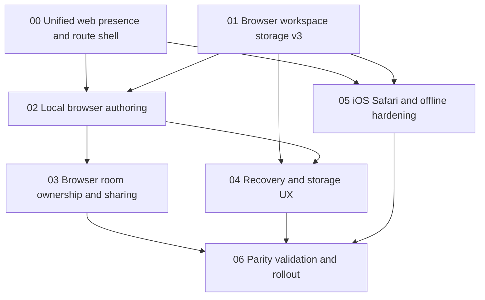

# Browser-owned workspaces, authoring, and sharing

Date: 2026-07-10
Status: proposed implementation plan
Owner: attn web

## Product thesis

The hosted attn surface should become a private writing desk that happens to
share, not a cloud document service with accounts removed. Opening `attn.sh`
must let someone create a workspace in one click or import Markdown plus its
referenced assets, keep it on that device, and explicitly publish an
end-to-end-encrypted review room when they choose Share. A recipient can open
the same multi-file room in either the browser or native attn.

There is no signup, login, cookie identity, or server-side workspace database.
The relay continues to hold only encrypted room envelopes and encrypted blob
objects with TTL/cap limits. Browser-owned source files remain origin-local.

## Product decisions

1. **One origin:** marketing, local workspaces, and review links converge on
   `https://attn.sh`. Origin-scoped storage and room recovery must not be split
   across `www`, `app`, and `review` subdomains.
2. **Local-first, not cloud-first:** the home page says “On this device,” not
   “Your account.” Creating a file makes no network request.
3. **IndexedDB is the required baseline:** it owns transactions, workspace/file
   metadata, encrypted small revisions, keys, recovery records, and outboxes.
4. **OPFS is a capacity/performance tier:** it stores larger encrypted revision
   and attachment bodies. The app remains usable through an IndexedDB Blob
   fallback when OPFS is unavailable, including Safari Private Browsing.
5. **Cache Storage contains only the app shell:** no document, room key, invite,
   event, or user-authored plaintext enters a service-worker cache.
6. **Sharing creates a room, not a cloud copy:** the current workspace remains
   the source of truth. Share creates the existing room policy, owner identity,
   encrypted snapshot, browser link, and native `attn://` link.
7. **Durability is explicit:** before the first share, attn requests persistent
   storage and asks the user to download a Markdown backup. If persistence is
   denied, sharing is allowed only after an explicit risk acknowledgement.
8. **No false local security claim:** local encryption prevents raw content from
   sitting in browser databases and backups, but same-origin code running in an
   unlocked profile can decrypt it. The E2EE guarantee is that attn services
   cannot read content.
9. **Workspaces are folder-shaped:** a workspace may contain multiple Markdown
   files and arbitrary binary assets. Web and native preserve relative paths and
   share the same selected file set; only an allowlist of safe media types is
   rendered inline, while other assets remain downloadable.

## Information architecture

| Route | Page | Purpose |
|---|---|---|
| `/` | Web/native landing | Reframe attn as “write here or open local”; primary CTA opens the local desk, secondary CTA installs native. |
| `/app` | Local workspace home | Create blank Markdown, import files, resume recent workspaces, join a review link, and see storage health. |
| `/app/w/:workspaceId/:fileId` | Browser authoring workspace | Local file tree, editor/view surface, review rail, save state, connection state, and Share. |
| `/app/storage` | Storage & recovery | Persistence status, usage/quota, workspace export/import, room-link recovery, and delete-local-data controls. |
| `/review/:roomId#key=…` | Shared review | Existing hosted review/join surface; opens the same file/comment model as native. |
| `/open` | Import handoff | Accept `.md`, multi-file selection, `.zip`, and future `.attn-workspace` recovery imports. |

`/app/new` is intentionally not an intermediate page. The landing-page **New
workspace** action atomically creates a local workspace containing
`untitled.md` and routes directly to its editor; naming is inline. This must be
a single user click with no dialog and no network request.

## Page design direction

The visual language stays editorial and tactile: paper, ink, rust-red action,
Source Serif/Source Sans/Source Code Pro, strong rules, and asymmetric document
layouts. The browser home should resemble a desk or folio, never a card-heavy
analytics dashboard. The memorable object is a live sheet of Markdown whose
margin contains collaboration—not a generic product illustration.

See:

- [page designs](00-web-presence.md)
- [architecture](architecture.md)
- [interactive static prototype](prototype.html)

## Dependency graph

Phases 00 and 01 can begin in parallel. Phase 05 can begin as soon as their
route/storage contracts exist. Room ownership and recovery UX can proceed in
parallel after local authoring lands.

## Success criteria

- A first-time visitor can create and edit a workspace with one click, without
  an account and without any room or relay request.
- Web and native can open, preserve, export, and share multiple Markdown files
  plus referenced images/assets without flattening paths or dropping bytes.
- Reload restores the local workspace on current iOS Safari, including an
  installed Home Screen Web App.
- A browser owner can share a document and produce browser, native-app, and CLI
  invite forms backed by the existing E2EE room protocol.
- Browser and native recipients can comment and suggest; live co-editing works
  while the browser owner authority is online and degrades honestly when not.
- IndexedDB is the complete compatibility baseline; OPFS absence never causes
  data loss or blocks small Markdown workspaces.
- Storage pressure, denied persistence, Private Browsing, Lockdown Mode, and
  interrupted migrations produce explicit recoverable UI states.
- The landing page, app, and review route deploy under one Cloudflare origin
  with route-level bundles and no third-party scripts or analytics.
- Local and Cloudflare-staging Playwright pass on Chromium and WebKit; a real
  current iPhone/iPad Safari device matrix is required before production.
- Relay/R2 logs and stored state contain no document plaintext, local workspace
  key, invite fragment, SDP, or ICE candidate plaintext.

## Primary-source browser findings

- WebKit supports OPFS on iOS/iPadOS 15.2+ and macOS 12.2+, but reports it as
  unavailable in Safari Private Browsing.
- Safari 17+ fully supports `StorageManager.estimate()`, `persisted()`, and
  `persist()`. Persistence is heuristic; Home Screen installation is one input.
- WebKit storage remains quota-bound and whole origins can be evicted in
  best-effort mode. Quota errors must therefore be handled even after an
  optimistic estimate.
- Safari Lockdown Mode may disable IndexedDB and Web Locks. Capability probes,
  not user-agent sniffing, decide whether authoring is available.

Sources:

- https://webkit.org/blog/12257/the-file-system-access-api-with-origin-private-file-system/
- https://webkit.org/blog/14403/updates-to-storage-policy/
- https://developer.apple.com/documentation/safari-release-notes/safari-17-release-notes
- https://developer.apple.com/documentation/safari-release-notes/safari-26-release-notes
- https://www.w3.org/TR/IndexedDB/
