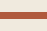
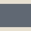
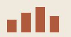

# Images

A fixture for relative image resolution in the native viewer (attn-cgev).
Every src below is authored the way a human or an agent actually writes one;
the viewer resolves each against **this file's own directory** and serves it
through the `attn://` protocol handler.

## Sibling, dot-slash

## Sibling, bare

## Subdirectory

## Vector

A referenced `.svg` is an ordinary image node — the browser loads it as an
image document. This is not the embedded-SVG path; that one is for raw `<svg>`
blocks written inline in the markdown source.

## Absolute URL

Anything with a scheme passes through untouched, so remote images keep working.

## Missing file

The graceful state: alt text and a filename, not the platform's broken-image
glyph.

