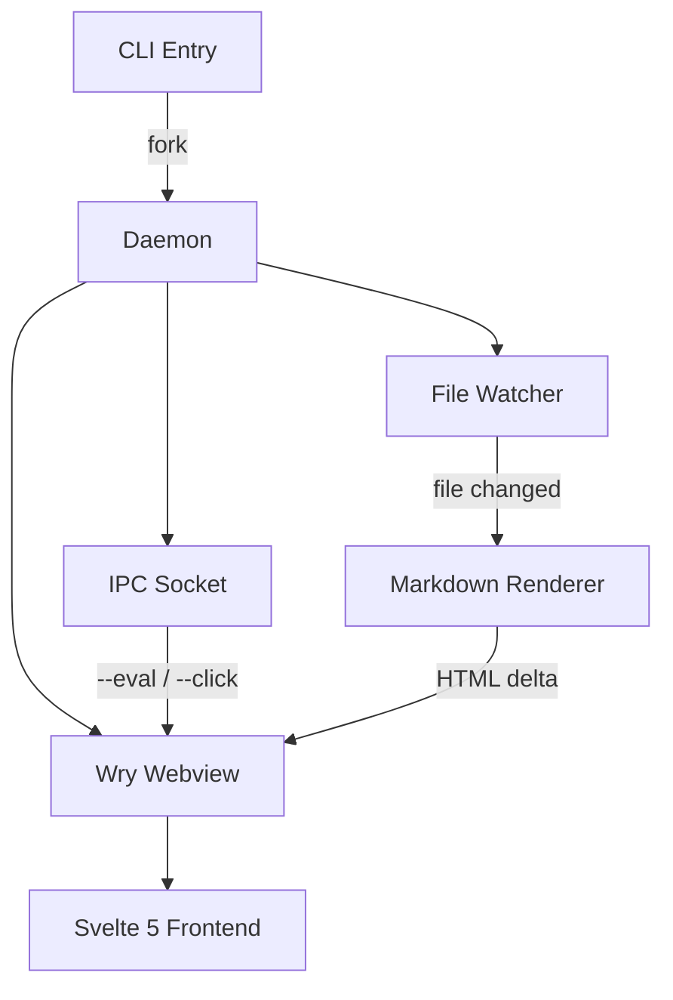

# Sprint 24 — CLI Overhaul

Last sync: 2026-02-28. Tracking the `v0.9` milestone toward a stable public release.

## Goals

We're consolidating the daemon architecture and reworking the IPC layer before the `v1.0` cut. The main bottleneck is the `O(n)` file-watcher scan on large workspaces — we need to get it down to $O(n \log n)$ worst-case or better by switching to a tree-diffing approach.

> "Make it work, make it right, make it fast — in that order."
> — Kent Beck

## Tasks

- [x] Migrate socket protocol from JSON to MessagePack
- [x] Implement `--query` structured DOM introspection
- [x] Add breadcrumb navigation for nested directories
- [ ] Replace linear watcher with `notify` debounced batching
- [ ] Support `--theme` flag for `light` | `dark` | `system`
- [ ] Wire up `Cmd+P` command palette with fuzzy file search
- [ ] Expose `window.__attn__` bridge for plugin authors
- [ ] Write migration guide for `v0.8` → `v0.9` config changes

## Architecture Sketch



## Daemon Lifecycle

The core event loop in `src/daemon.rs` handles three multiplexed channels. Here's the simplified dispatch after the refactor:

```rust
pub async fn run(config: Config) -> Result<()> {
    let (tx, mut rx) = mpsc::channel(64);
    let watcher = FileWatcher::new(config.root.clone(), tx.clone())?;
    let socket = IpcSocket::bind(&config.socket_path)?;

    loop {
        tokio::select! {
            Some(event) = rx.recv() => match event {
                Event::FileChanged(path) => {
                    let html = render_markdown(&path)?;
                    webview.evaluate(&format!(
                        "window.__attn__.updateContent({})",
                        serde_json::to_string(&html)?
                    ))?;
                }
                Event::IpcCommand(cmd) => {
                    handle_ipc(&webview, cmd).await?;
                }
                Event::Shutdown => break,
            },
            conn = socket.accept() => {
                let tx = tx.clone();
                tokio::spawn(handle_connection(conn?, tx));
            }
        }
    }
    Ok(())
}
```

## Performance Benchmarks

Measured on an M2 MacBook Air with a 1,200-file workspace:

| Operation         | Before (v0.8) | After (v0.9) | Delta   |
|-------------------|---------------|--------------|---------|
| Cold start        | 340 ms        | 185 ms       | −45.6%  |
| File change render| 120 ms        | 38 ms        | −68.3%  |
| IPC round-trip    | 22 ms         | 6 ms         | −72.7%  |
| Memory (idle)     | 48 MB         | 31 MB        | −35.4%  |
| Watcher init      | 890 ms        | 210 ms       | −76.4%  |

### Profiling Notes

The `render_markdown` hot path now uses `comrak` with a pooled arena allocator. Syntax highlighting via `syntect` is lazily loaded — only themes referenced by the active stylesheet are parsed. The `ThemeSet::load_defaults()` call was the single biggest contributor to cold start latency; swapping to `load_from_reader` with a vendored binary blob saved ~95 ms.

## Open Questions

1. Should `--eval` return structured JSON by default, or keep raw string output for shell piping?
2. Do we gate the `--screenshot` flag behind a `debug_assertions` cfg, or expose it as an opt-in feature flag?
3. The `window.resizeTo` call is a no-op on Wayland — do we need a native resize IPC message?
